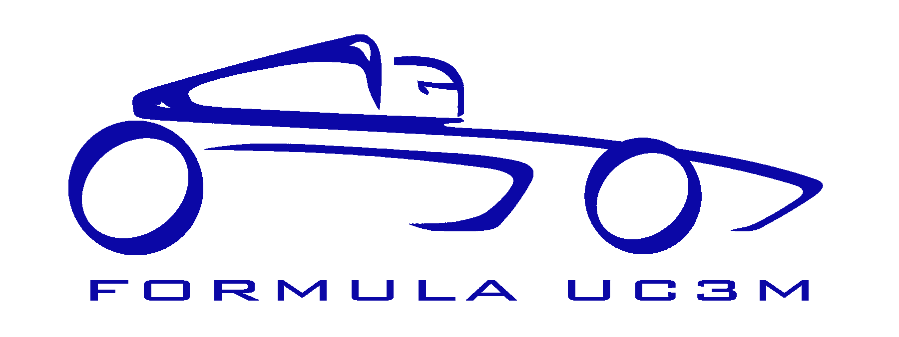

# Fórmula UC3M Telemetria

> Proyecto para la realización de la telemetría al monoplaza de la UC3M



Proyecto para la realización de las mediciones de los sensores del monoplaza con el fín de poder ver en tiempo real resultados que ayuden al equipo a optimizar los ajustes del mismo.

Además, todos los datos generados serán almacenados en la nube para luego poder ser explotados con el objetivo de mejorar carrera a carrera.

**Motivación**

Como no podía ser de otra manera, los compañeros de la UC3M y OSWeekends nos encontramos en el evento del [T3chfest 2018](https://t3chfest.uc3m.es/2018/) y hablando hablando... nos vinimos arriba y les propusimos echarles una mano con la telemetría.

Para nosotros era un reto tecnológico que se salia fuera de nuestro control ya que no es una de nuestras especialidades que usemos en nuestro día a día porque engloba hardware (arduino), comunicaciones(radio / 4g) y datos en tiempo real, así que fué una cosa que molaba la idea, ¡y mucho!

Al minuto 1 ya empezamos a desvariar sobre las cosas que ibamos a realizar, todo fluía por ambas partes, todo ello aderezado por un ambiente muy bueno, y aquí nos teneis.... ¡sacando el proyecto adelante!

Esperamos que a los que leáis estas líneas os haya cautivado la idea y os unáis a nosotros en este reto tan interesante que se sale de todos nuestros esquemas habituales.

## Servidor para guardado y explotación de datos en tiempo real.

> Proyecto para la realización de la telemetría al monoplaza de la UC3M. Dentro del proyecto, esta parte se encargará de la gestión del guardado y explotación de datos, en tiempo real.

## Tecnologías

- [**Node JS**](https://nodejs.org/en/): Entorno de ejecución de Javascript que funciona sobre el motor v8 de Google Chrome.
- [**MongoDB**](https://www.mongodb.com/es): Almacenamiento de datos para consulta en tiempo real.
- [**Mosca**](https://github.com/mcollina/mosca/wiki): Broker [MQTT](https://geekytheory.com/que-es-mqtt) para [Node JS](https://nodejs.org/en/).
- [**Pillars**](http://pillarsjs.com/): Framework de desarrollo web para Node.js.

## Instalación

Primero clona este repositorio:

```shell
git clone git@github.com:OSWeekends/formula-uc3m.git
```

Es necesario recordar que debes de tener instalado en tu ordenador MongoDB, Node JS y NPM (Gestor de paquetes de Node JS) antes de empezar a instalar este proyecto.
Una vez clonado puedes entrar a la carpeta `./server` y ejecutar el siguiente comando:

```shell
npm install
```

Una vez realizado esto ya deberían estar instaladas todas las dependencias de este paquete. Ahora debes copiar el fichero `.env.example` y crear un fichero `.env`, dentro debes sustituir la configuración de ejemplo por la de tu base de datos.

##### Configuración del `.env`:

*  **MONGODB_URI**: Url de conexión a mongo db.
*  **HOST**: Host del servidor web.
*  **WEB_PORT**: Puerto del servidor web.
*  **MQTT_PORT**: Puerto del servidor de datos con mosca y mqtt.
*  **DEBUG_MODE**: 1 o 0. Indica si la aplicación está en modo debug o no.
*  **RESOLUTION**: Se utiliza para guardar datos, se agrupan todos los datos recibidos en el rango de tiempo (en milisegundos) especificado en este parámetro. De esta forma si aquí pusieramos 1000 (1s) aunque el coche estuviese enviando datos cada 5 milisegundos se iría actualizando el valor de ese sensor en un objeto y pasado el segundo guardaría todo. Este valor debe estar entre los 10 y los 50 milisegundos.
*  **JWT_SECRET_TOKEN**: Palabra secreta utilizada para generar los tokens de autentificación. (Para cambiar los rangos de los sensores, por ejemplo).
*  **JWT_TOKEN_EXP_DAYS**: Días que tarda un token de autentificación en expirar.
*  **CREATE_USERS_SECRET_WORD**: Esta "contraseña" o secreto se usa para crear usuarios `/signup`. Para crear usuarios te pide un campo "Secret" que sería como una contraseña o palabra clave que escribes aquí. Hace que solo aquel que conozca esta contraseña pueda crear usuarios.
*  **DATA_FAKER_ENABLED**: 1 o 0. Activar el generador de datos fake o no.
*  **DATA_FAKER_ADDITION_PERCENTAGE**: Porcentaje de incremento del valor publicado por el faker. Cada vez que se publica un valor de un sensor se esperan unos milisegundos y se vuelve a publicar otro valor, que es el valor anterior sumado a un valor de aumento. Este valor de aumento se calcula como un porcentaje (el aquí definido) sobre el rango de valores.
*  **DATA_FAKER_INTERVAL_MS**: Tiempo medio entre publicar un valor y el siguiente en el faker de datos.

Una ver realizado esto ya estaría completamente instalado y listo para arrancar (recuerda arrancar el servidor de base de datos antes de arrancar este servidor).

**¡Importante! Antes de iniciar el servidor**

Antes de arrancar el servidor debes tener arrancada la base de datos mongo db usando el demonio **mongod**.

```sh
mongod
```

**Cómo iniciar el servidor**

```sh
npm start
```
Abre la url http://localhost:3001/ (Siendo localhost y 3001 el host y el port que asignaste en el archivo .env).

**Cómo comprobar los test**

```sh
npm test
```

**Cómo comprobar que el código cumple la especificación del [linter](https://eslint.org/docs/about/)**

```sh
npm run lint
```

## Equipo

De la creación y gestión del servidor de datos en tiempo real se encargará el equipo ArduData.

- [Javier Gallego (@bifuer)](https://github.com/bifuer) Lider
- [Sebastián Cabanas (@Sediug)](https://github.com/Sediug) Lider
- [Óliver BM(@umowis)](https://github.com/umowis) Contributor
- [Rubén Moreno (@rubenmoreno94)](https://github.com/rubenmoreno94) Contributor  Pruebas de conexión Arduino <> Servidor
- [Alfredo de la Calle(@bytelovers)](https://github.com/bytelovers) Contributor  Script build que trae el front y lo monta.
- [Ulises Gascón(@UlisesGascon)](https://github.com/UlisesGascon) Contributor  Migración a nuevo repositorio y consultoría técnica.
- [Bryan McEire (@mceire)](https://github.com/mceire) Contributor  Dockerización del proyecto :D!

## Contribuir
Puedes contribuir al apartado de backend, dentro del proyecto de Formula UC3M, leyendo las [issues con la etiqueta back](https://github.com/Formula-UC3M/telemetria-documentacion/issues?q=is%3Aissue+is%3Aopen+label%3ABack). Toda la documentación issues y roadmap se encuentran en el proyecto [Telemetria Documentación](https://github.com/Formula-UC3M/telemetria-documentacion).


### Licencia

[GNU Affero General Public License v3.0](https://github.com/OSWeekends/formula-uc3m/blob/master/LICENSE)


